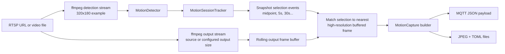

# Architecture Notes

## Selected tooling

- `ffmpeg` CLI handles decoding, scaling, FPS throttling, and protocol support without pulling OpenCV into the binary.
- `rumqttc` provides a small MQTT client with a dedicated network loop.
- Standard library threads keep the runtime model simple: one thread ingests frames, one analyzes motion, and MQTT runs on its own worker threads.
- Docker packages the binary plus `ffmpeg` so local and containerized runs behave the same way.

## Detection approach

- A low-resolution `ffmpeg` stream feeds motion detection at `frame_width` x `frame_height`.
- A second `ffmpeg` stream feeds the snapshot pipeline at `output_frame_width` x `output_frame_height`, or source resolution if output dimensions are omitted.
- `src/motion.rs` only analyzes the low-resolution stream.
- `src/session.rs` groups frame-level activity into motion sessions, tracks session start/end, and chooses representative snapshot frames.
- The processor keeps a short rolling buffer of high-resolution frames, then matches selected snapshot moments to the nearest buffered high-resolution frame.
- The chosen frame is JPEG-encoded and embedded in the MQTT payload as Base64 or written to disk.

## Service boundaries

- `src/config.rs`: CLI parsing, TOML loading, and validation.
- `src/ffmpeg.rs`: ffmpeg argument construction and frame streaming.
- `src/motion.rs`: background model, motion scoring, and JPEG snapshot encoding.
- `src/mqtt.rs`: MQTT startup, publishing, and event-loop management.
- `src/output.rs`: shared event formatting for MQTT JSON and file output.
- `src/session.rs`: session start/end tracking and delayed snapshot selection.
- `src/app.rs`: dual-stream coordination, rolling output-frame buffer management, and final output assembly.
- `scripts/container-entrypoint.sh`: converts `CAMWATCH_INPUT` into the CLI arguments expected by the binary.

## Practical trade-offs

- Using the system `ffmpeg` binary keeps the Rust dependency tree lighter than OpenCV while still supporting RTSP well.
- Publishing JSON plus Base64 snapshots is easy for downstream consumers, though raw binary topics would be smaller if that becomes necessary later.
- Writing `.jpg` and `.toml` pairs to disk makes it easy to inspect motion events without an MQTT subscriber.
- Fixed-size analysis frames trade some fidelity for predictable CPU and memory usage.
- The container image is not scratch-minimal because it intentionally carries the system `ffmpeg` runtime.
